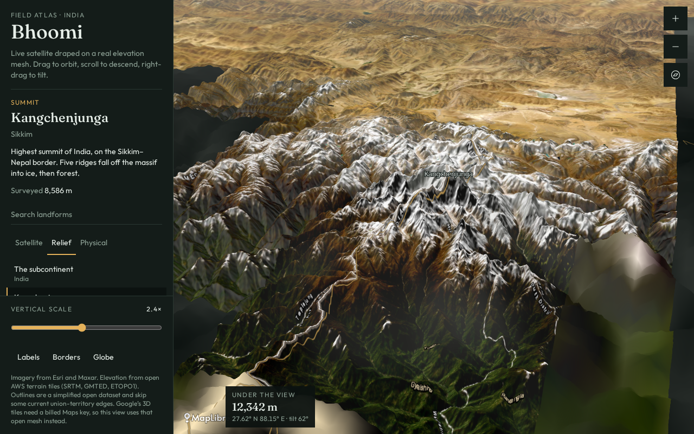

# Bhoomi

Full-HD 3D topographic map of India.

**Open:** https://github.com/boss974829/boomi



## Run the map

```bash
git clone https://github.com/boss974829/boomi.git
cd boomi
npm install
npm run dev
```

Then open [http://localhost:8080](http://localhost:8080).

## What it shows

- Satellite imagery draped on elevation
- Relief and hillshade
- State borders
- Named landforms, including Kangchenjunga and the Western Ghats
- An exaggeration slider, an elevation readout, and a globe view

Terrain uses public elevation tiles. Imagery is Esri satellite. This is a field atlas of the land, not a political map.

A public opening page is in [docs/index.html](docs/index.html). GitHub Pages could not be switched on from here. In the repo, go to **Settings → Pages**, set the source to the `main` branch and the `/docs` folder, and the site will be [https://boss974829.github.io/boomi/](https://boss974829.github.io/boomi/).
